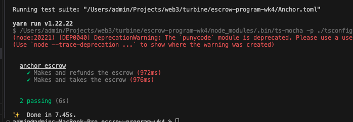

# Escrow Program (Week 4)

A Solana escrow program built with the Anchor framework that enables trustless token swaps between two parties.

## Overview

This program implements a simple escrow mechanism where a maker can deposit tokens (Token A) and specify the amount of different tokens (Token B) they wish to receive in exchange. A taker can then fulfill the escrow by providing the requested tokens.

## Features

- **Make Escrow**: Create an escrow account and deposit Token A into a program-controlled vault
- **Refund**: Cancel the escrow and retrieve deposited tokens
- **Take Escrow**: Fulfill the escrow by providing Token B and receiving Token A

## Program Instructions

### 1. Make
Creates a new escrow account and deposits tokens.

**Parameters:**
- `seed`: u64 - Unique identifier for the escrow
- `deposit`: u64 - Amount of Token A to deposit
- `receive`: u64 - Amount of Token B requested in exchange

### 2. Refund
Allows the maker to cancel the escrow and retrieve their deposited tokens.

### 3. Take
Allows a taker to fulfill the escrow by providing the requested tokens in exchange for the deposited tokens.

## Test
